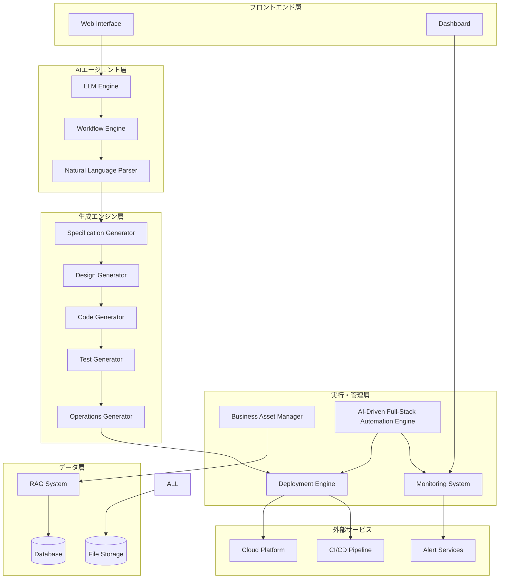
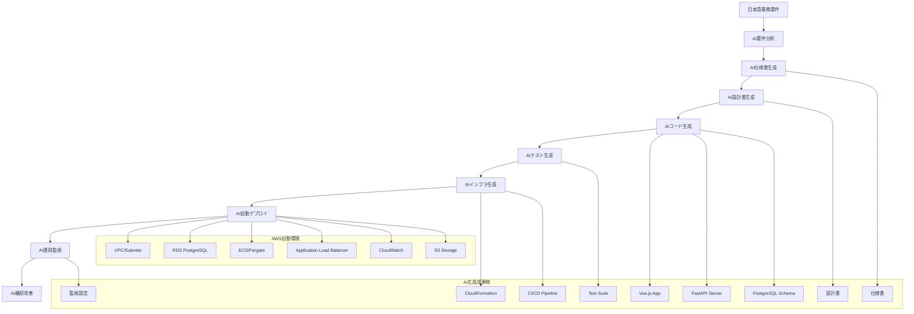
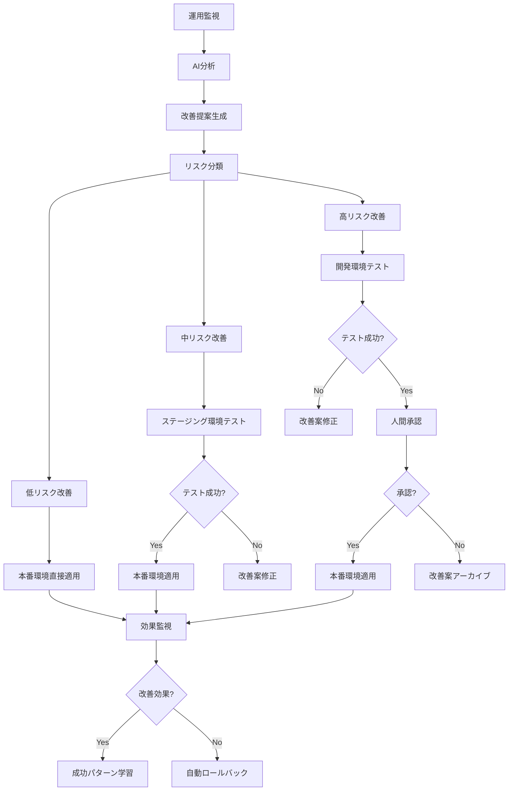

# 設計書

## 概要

Business Spec Generatorは、日本語で記述された「受注〜請求〜入金確認」業務要件を入力として受け取り、仕様書・設計書・ソースコード・テストコード・運用フローを自動生成し、実際に動作するシステムを自動構築・デプロイ・運用するAIエージェントシステムです。

中小企業が業務要件を自然言語で入力するだけで、完全に動作する請求システムが自動構築され、継続的な改善まで提供されます。

## アーキテクチャ

### システム全体構成



### 技術スタック

- **フロントエンド**: Vue.js 3 + Composition API (シンプルなWeb UI)
- **バックエンド**: Python + FastAPI (サーバレス対応)
- **AI/LLM**: OpenAI GPT-4 + カスタムプロンプト
- **ワークフロー**: AWS Step Functions
- **データベース**: PostgreSQL (Amazon RDS)
- **RAG**: Pinecone + OpenAI Embeddings
- **インフラ**: AWS (Lambda, ECS, S3, CloudFormation)
- **CI/CD**: GitHub Actions + AWS CodePipeline
- **監視**: CloudWatch + DataDog
- **開発自動化**: AI Full-Stack Generator + AWS完全自動化環境

## コンポーネントとインターフェース

### 1. Web Interface
- **責任**: ユーザーからの業務要件入力受付、対話的質問提示、進捗表示
- **主要API**:
  - `POST /api/requirements` - 業務要件の投稿
  - `GET /api/questions/{sessionId}` - 不足情報の質問取得
  - `POST /api/answers/{sessionId}` - 質問への回答投稿
  - `GET /api/progress/{projectId}` - 生成進捗の取得

### 2. LLM Engine
- **責任**: 自然言語処理、コンテンツ生成、品質チェック
- **主要機能**:
  - 業務要件の構造化
  - 仕様書・設計書の生成
  - ソースコード生成
  - テストコード生成

### 3. Workflow Engine
- **責任**: 生成プロセスの管理、ステップ間の調整、エラーハンドリング
- **主要機能**:
  - 生成フローの実行管理
  - 依存関係の解決
  - 失敗時のリトライ・代替処理

### 4. Code Generator
- **責任**: 実行可能なソースコードの生成
- **生成対象**:
  - フロントエンド (Vue.js 3 + Composition API)
  - バックエンドAPI (Python + FastAPI)
  - データベーススキーマ (PostgreSQL)
  - インフラコード (AWS CloudFormation)

### 5. Deployment Engine
- **責任**: 生成されたシステムの自動デプロイ
- **主要機能**:
  - クラウドリソースの作成
  - アプリケーションのデプロイ
  - 稼働確認テストの実行

### 6. Business Asset Manager
- **責任**: 生成された成果物の管理、バージョン管理
- **管理対象**:
  - 要件定義書
  - 仕様書・設計書
  - ソースコード
  - テストコード
  - 運用フロー

### 7. AI-Driven Full-Stack Automation Engine
- **責任**: AIによる要件定義から運用監視まで完全自動化
- **主要機能**:
  - AI仕様書・設計書自動生成
  - AIソースコード・テスト自動生成
  - AI運用フロー・監視設定自動生成
  - AWS環境での完全自動デプロイ・運用

## データモデル

### プロジェクト管理

```sql
-- プロジェクト
CREATE TABLE projects (
    id UUID PRIMARY KEY,
    name VARCHAR(255) NOT NULL,
    description TEXT,
    status VARCHAR(50) NOT NULL, -- 'requirements', 'specification', 'design', 'implementation', 'testing', 'deployment', 'operational'
    created_at TIMESTAMP DEFAULT NOW(),
    updated_at TIMESTAMP DEFAULT NOW()
);

-- 業務要件
CREATE TABLE business_requirements (
    id UUID PRIMARY KEY,
    project_id UUID REFERENCES projects(id),
    original_text TEXT NOT NULL,
    structured_data JSONB NOT NULL,
    completeness_score DECIMAL(3,2),
    created_at TIMESTAMP DEFAULT NOW()
);

-- 生成成果物
CREATE TABLE generated_artifacts (
    id UUID PRIMARY KEY,
    project_id UUID REFERENCES projects(id),
    artifact_type VARCHAR(50) NOT NULL, -- 'specification', 'design', 'code', 'test', 'operations'
    content TEXT NOT NULL,
    metadata JSONB,
    version INTEGER DEFAULT 1,
    created_at TIMESTAMP DEFAULT NOW()
);
```

### RAGシステム

```sql
-- 知識ベース
CREATE TABLE knowledge_base (
    id UUID PRIMARY KEY,
    content_type VARCHAR(50) NOT NULL, -- 'requirement_pattern', 'design_pattern', 'code_template'
    content TEXT NOT NULL,
    embedding VECTOR(1536),
    metadata JSONB,
    created_at TIMESTAMP DEFAULT NOW()
);

-- 顧客仕様
CREATE TABLE customer_specifications (
    id UUID PRIMARY KEY,
    customer_id UUID,
    specification_type VARCHAR(50) NOT NULL,
    specification_data JSONB NOT NULL,
    created_at TIMESTAMP DEFAULT NOW()
);
```

### 実行・監視

```sql
-- デプロイメント履歴
CREATE TABLE deployments (
    id UUID PRIMARY KEY,
    project_id UUID REFERENCES projects(id),
    deployment_status VARCHAR(50) NOT NULL,
    cloud_resources JSONB,
    deployment_log TEXT,
    created_at TIMESTAMP DEFAULT NOW()
);

-- 監視データ
CREATE TABLE monitoring_data (
    id UUID PRIMARY KEY,
    project_id UUID REFERENCES projects(id),
    metric_name VARCHAR(100) NOT NULL,
    metric_value DECIMAL,
    timestamp TIMESTAMP DEFAULT NOW()
);
```

## 正確性プロパティ

*プロパティとは、システムの全ての有効な実行において真であるべき特性や動作のことです。プロパティは人間が読める仕様と機械で検証可能な正確性保証の橋渡しをします。*

### プロパティ反映

分析したプロパティを確認し、冗長性を排除します：

**冗長性の特定:**
- プロパティ2.1〜2.4は全て「仕様書生成時の要素包含」を検証しており、統合可能
- プロパティ3.1〜3.4は全て「設計書生成時の要素包含」を検証しており、統合可能  
- プロパティ5.1〜5.4は全て「テスト生成時の要素包含」を検証しており、統合可能
- プロパティ6.1〜6.4は全て「運用フロー生成時の要素包含」を検証しており、統合可能

**統合後のプロパティ:**

**プロパティ 1: 自然言語要件の構造化**
*任意の* 日本語業務要件に対して、システムは構造化された要件定義を生成し、不足情報がある場合は適切な質問を生成する
**検証: 要件 1.1, 1.2, 1.3, 1.4**

**プロパティ 2: 仕様書生成の完全性**
*任意の* 確定した業務要件に対して、生成される仕様書は機能要件、非機能要件、図表、バージョン管理情報を含む
**検証: 要件 2.1, 2.2, 2.3, 2.4**

**プロパティ 3: 設計書生成の完全性**
*任意の* 確定した仕様書に対して、生成される設計書はアーキテクチャ、データベース、API、外部連携の設計を含む
**検証: 要件 3.1, 3.2, 3.3, 3.4**

**プロパティ 4: ソースコード生成の実行可能性**
*任意の* 確定した設計書に対して、生成されるソースコードは指定技術スタックで実行可能であり、エラーハンドリングと検証を含む
**検証: 要件 4.1, 4.2, 4.3, 4.4**

**プロパティ 5: テストスイート生成の包括性**
*任意の* 生成されたソースコードに対して、生成されるテストスイートは単体・統合・E2E・プロパティベーステストを含み品質レポートを生成する
**検証: 要件 5.1, 5.2, 5.3, 5.4**

**プロパティ 6: 運用フロー生成の完全性**
*任意の* 構築完了したシステムに対して、生成される運用フローはCI/CD、監視、バックアップ、更新対応を含む
**検証: 要件 6.1, 6.2, 6.3, 6.4**

**プロパティ 7: システムデプロイの自動化**
*任意の* 完成した成果物に対して、システムは自動デプロイ、稼働確認、監視開始、要件変更対応を実行する
**検証: 要件 7.1, 7.2, 7.3, 7.4**

## エラーハンドリング

### 1. 生成エラーの処理
- **LLM生成失敗**: 代替プロンプト、モデル切り替え、人間への確認要求
- **コード生成エラー**: 構文チェック、自動修正、テンプレートフォールバック
- **デプロイエラー**: ロールバック、代替環境、手動介入通知

### 2. 外部サービス障害対応
- **クラウドAPI障害**: リトライ機構、代替リージョン、ローカル実行
- **RAGシステム障害**: キャッシュ利用、基本テンプレート、縮退運転

### 3. データ整合性保証
- **トランザクション管理**: 生成プロセス全体のACID特性保証
- **バージョン管理**: 成果物間の整合性維持
- **バックアップ**: 定期的な自動バックアップと復旧機能

## テスト戦略

### 単体テスト
- **LLMエンジン**: プロンプト品質、出力形式検証
- **生成エンジン**: 各生成器の出力品質
- **デプロイエンジン**: デプロイ手順の正確性

### 統合テスト  
- **エンドツーエンド**: 要件入力からシステム稼働までの全フロー
- **外部連携**: クラウドサービス、CI/CDパイプラインとの連携
- **エラーシナリオ**: 各種障害時の復旧動作

### プロパティベーステスト
- **Hypothesis** (Python)を使用
- 各プロパティを最低100回実行
- ランダムな業務要件、仕様書、設計書を生成してテスト

### パフォーマンステスト
- **生成速度**: 各段階の生成時間測定
- **スケーラビリティ**: 同時プロジェクト処理能力
- **リソース使用量**: メモリ、CPU、ストレージ使用量監視

## AI駆動フルスタック自動化エンジン

### AI仕様書・設計書自動生成
- **要件分析AI**: 日本語業務要件の意図理解・構造化・不足情報特定
- **仕様書生成AI**: 機能要件・非機能要件・ユースケース・データフローの自動生成
- **設計書生成AI**: アーキテクチャ・データベース・API・UI設計の自動生成
- **品質保証AI**: 仕様・設計の整合性チェック・最適化提案

### AIソースコード・テスト自動生成
- **フロントエンド生成AI**: Vue.js 3 + Composition APIの完全なWebアプリケーション自動生成
- **バックエンド生成AI**: Python + FastAPIの完全なAPIサーバー自動生成
- **データベース生成AI**: PostgreSQLスキーマ・インデックス・制約の自動生成
- **テスト生成AI**: 単体・統合・E2E・プロパティベーステストの包括的自動生成
- **インフラ生成AI**: AWS CloudFormation/Terraformの完全なインフラコード自動生成

### AI運用フロー・監視設定自動生成
- **CI/CD生成AI**: GitHub Actions/AWS CodePipelineの完全なパイプライン自動生成
- **監視設定生成AI**: CloudWatch・DataDog・アラート設定の自動生成
- **運用手順生成AI**: デプロイ・バックアップ・復旧・スケーリング手順の自動生成
- **セキュリティ設定生成AI**: IAM・VPC・セキュリティグループ・暗号化設定の自動生成

### AWS環境での完全自動デプロイ・運用
- **自動プロビジョニング**: AWS環境の完全自動構築・設定
- **ゼロダウンタイムデプロイ**: Blue-Green/Canaryデプロイの自動実行
- **自動スケーリング**: 負荷に応じたリソース自動調整
- **自動復旧**: 障害検知・自動復旧・ロールバック
- **コスト最適化**: リソース使用量監視・自動最適化

### AI学習・改善エンジン
- **成功パターン学習**: 過去の成功事例からベストプラクティス学習
- **エラーパターン学習**: 失敗事例から改善点学習・予防策生成
- **顧客固有学習**: 顧客の業務特性・技術選好の学習・カスタマイズ
- **継続改善**: 運用データからシステム改善提案・自動適用

### 請求業務改善提案エンジン（Improvement_Engine）
- **請求ログ分析**: 請求処理時間、入金日数、未入金率の詳細分析
- **パターン検出**: 請求遅延パターン、入金遅延要因、未入金顧客特徴の自動検出
- **改善案生成**: 請求タイミング最適化、リマインド頻度調整、請求書フォーマット改善案の自動生成
- **ワンクリック適用**: 承認された改善案の業務DSLと処理ロジックへの自動反映

### 完全自動化データモデル

```sql
-- AI生成プロジェクト管理
CREATE TABLE ai_generated_projects (
    id UUID PRIMARY KEY,
    business_project_id UUID REFERENCES projects(id),
    generation_phase VARCHAR(50) NOT NULL, -- 'requirements', 'specification', 'design', 'implementation', 'deployment', 'operational'
    ai_confidence_score DECIMAL(3,2), -- AI生成の信頼度
    human_intervention_required BOOLEAN DEFAULT FALSE,
    created_at TIMESTAMP DEFAULT NOW()
);

-- AI生成成果物
CREATE TABLE ai_generated_artifacts (
    id UUID PRIMARY KEY,
    ai_project_id UUID REFERENCES ai_generated_projects(id),
    artifact_type VARCHAR(50) NOT NULL, -- 'specification', 'design', 'frontend_code', 'backend_code', 'database_schema', 'infrastructure_code', 'tests', 'ci_cd', 'monitoring'
    generation_model VARCHAR(100) NOT NULL, -- 使用したAIモデル
    content TEXT NOT NULL,
    quality_score DECIMAL(3,2),
    generated_at TIMESTAMP DEFAULT NOW()
);

-- AI実行・監視ログ
CREATE TABLE ai_execution_logs (
    id UUID PRIMARY KEY,
    ai_project_id UUID REFERENCES ai_generated_projects(id),
    execution_phase VARCHAR(50) NOT NULL,
    ai_decision_log JSONB, -- AIの判断プロセス
    execution_result VARCHAR(50) NOT NULL, -- 'success', 'partial_success', 'failed'
    error_details TEXT,
    execution_time_ms INTEGER,
    executed_at TIMESTAMP DEFAULT NOW()
);

-- AI学習データ
CREATE TABLE ai_learning_data (
    id UUID PRIMARY KEY,
    project_outcome VARCHAR(50) NOT NULL, -- 'success', 'failure', 'partial_success'
    business_domain VARCHAR(100),
    technical_stack JSONB,
    success_factors JSONB,
    failure_factors JSONB,
    lessons_learned TEXT,
    created_at TIMESTAMP DEFAULT NOW()
);
```

### AI完全自動化実行フロー



## 請求業務改善提案実行システム

### 請求業務改善提案の分類と実行場所

#### 1. 請求タイミング最適化（自動実行）
**実行場所**: 本番環境で直接実行
- **請求日調整**: 入金率の高い曜日・時間帯への請求タイミング変更
- **リマインド頻度調整**: 未入金顧客への最適なリマインド間隔設定
- **請求書送付方法最適化**: メール・郵送の顧客別最適化
- **請求金額端数処理**: 入金しやすい金額への自動調整

#### 2. 請求書フォーマット改善（テスト後実行）
**実行場所**: テスト環境 → 本番環境
- **請求書レイアウト改善**: 視認性・理解しやすさの向上
- **支払い方法表示改善**: 振込先・支払い期限の明確化
- **請求内容詳細化**: 商品・サービス内容の詳細表示
- **多言語対応**: 外国人顧客向けの言語対応

#### 3. 請求業務フロー変更（承認後実行）
**実行場所**: 開発環境 → ステージング環境 → 承認 → 本番環境
- **請求承認フロー変更**: 承認プロセスの追加・変更
- **入金確認方法変更**: 銀行API連携・手動確認の切り替え
- **未入金対応フロー変更**: エスカレーション・法的措置の自動化
- **顧客セグメント別処理**: VIP顧客・新規顧客別の特別処理

### 改善実行環境



### 請求業務改善実行データモデル

```sql
-- 請求業務改善提案管理
CREATE TABLE billing_improvement_proposals (
    id UUID PRIMARY KEY,
    ai_project_id UUID REFERENCES ai_generated_projects(id),
    proposal_type VARCHAR(100) NOT NULL, -- 'timing_optimization', 'format_improvement', 'workflow_change'
    improvement_category VARCHAR(50) NOT NULL, -- 'billing_timing', 'reminder_frequency', 'invoice_format', 'payment_method'
    current_performance JSONB, -- 現在の請求パフォーマンス
    expected_improvement JSONB, -- 期待される改善効果
    proposal_description TEXT NOT NULL,
    implementation_plan TEXT,
    created_at TIMESTAMP DEFAULT NOW()
);

-- 請求改善実行履歴
CREATE TABLE billing_improvement_executions (
    id UUID PRIMARY KEY,
    proposal_id UUID REFERENCES billing_improvement_proposals(id),
    execution_environment VARCHAR(50) NOT NULL, -- 'test', 'production'
    execution_status VARCHAR(50) NOT NULL, -- 'pending', 'testing', 'deployed', 'rolled_back', 'failed'
    billing_dsl_changes TEXT, -- 業務DSLの変更内容
    processing_logic_changes TEXT, -- 処理ロジックの変更内容
    execution_log TEXT,
    executed_at TIMESTAMP DEFAULT NOW()
);

-- 請求改善効果測定
CREATE TABLE billing_improvement_results (
    id UUID PRIMARY KEY,
    execution_id UUID REFERENCES billing_improvement_executions(id),
    metric_name VARCHAR(100) NOT NULL, -- 'payment_rate', 'processing_time', 'error_rate', 'customer_satisfaction'
    value_before DECIMAL,
    value_after DECIMAL,
    improvement_percentage DECIMAL,
    measurement_period_days INTEGER,
    measured_at TIMESTAMP DEFAULT NOW()
);

-- 請求改善承認履歴
CREATE TABLE billing_improvement_approvals (
    id UUID PRIMARY KEY,
    proposal_id UUID REFERENCES billing_improvement_proposals(id),
    approver_id VARCHAR(100) NOT NULL,
    approval_status VARCHAR(20) NOT NULL, -- 'pending', 'approved', 'rejected'
    approval_reason TEXT,
    business_impact_assessment TEXT, -- ビジネス影響評価
    approved_at TIMESTAMP
);
```

### 請求業務改善提案実行の具体例

#### 例1: 請求タイミング最適化（自動実行）
1. **検知**: 火曜日送付の請求書の入金率が月曜日より20%高い
2. **分析**: AIが曜日別入金率パターンを特定
3. **提案**: 請求書送付を火曜日に変更
4. **実行**: 本番環境で請求タイミングを自動変更
5. **監視**: 入金率向上を確認（14日間測定）

#### 例2: 請求書フォーマット改善（テスト後実行）
1. **検知**: 請求書に関する問い合わせが多い
2. **分析**: AIが支払い方法の記載が不明確と特定
3. **提案**: 振込先情報を請求書上部に大きく表示
4. **実行**: テスト環境で確認 → 本番適用
5. **監視**: 問い合わせ件数減少を確認

#### 例3: 未入金対応フロー変更（承認後実行）
1. **検知**: 未入金率が業界平均より高い
2. **分析**: AIがリマインド頻度が不適切と特定
3. **提案**: 3段階リマインド（7日後、14日後、21日後）に変更
4. **実行**: 開発環境テスト → 承認 → 段階的適用
5. **監視**: 未入金率低下と顧客満足度を確認